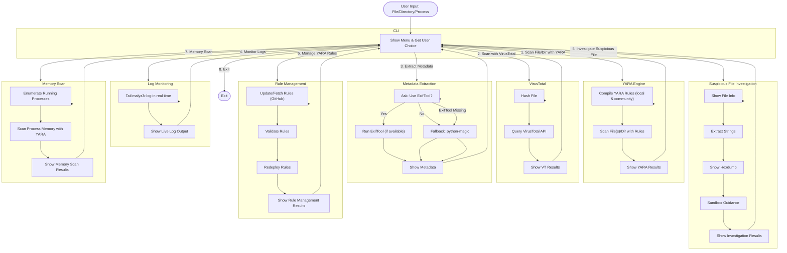

# malyz3r: Comprehensive Malware Scanner
Malware detection toolkit built for **security researchers**, **blue teams**, and **DFIR analysts**.  
Combines **YARA-based local scanning**, **metadata exfiltration checks**, and **VirusTotal integration** for next-level threat hunting.

---
## Features
- **Comprehensive YARA scanning**: Scans files, directories, and process memory using advanced and community YARA rules (including [YARA-Rules](https://github.com/Yara-Rules/rules)).
- **Memory scanning**: Scan all running processes' memory for fileless and in-memory threats.
- **Rule management**: Update, validate, and fetch the latest YARA rules from GitHub directly from the CLI.
- **VirusTotal integration**: Query file hashes against VirusTotal.
- **Metadata extraction**: Extract file metadata using ExifTool or python-magic.
- **Investigation tools**: Strings, hexdump, and more for suspicious files.
- **Centralized logging**: Colorized output and persistent logs.
- **Dependency checks**: Ensures all required binaries and Python packages are present.
- **Test suite**: Run `python -m malware_scanner.test_suite` to validate core functionality.

## Installation
1. Clone this repository.
2. Install dependencies:
  ```bash
  pip install -r requirements.txt
  ```
3. (Optional) Fetch the latest YARA-Rules for maximum coverage:
  - Use the CLI: Rule Management > Fetch/Update YARA-Rules from GitHub

## Usage
Run the scanner:
```bash
python run_scanner.py
```

## Menu Options
- Scan a file with YARA rules
- Scan with VirusTotal
- Extract metadata from file
- Scan all running processes' memory with YARA
- Monitor logs in real time
- Investigate suspicious files
- Manage YARA rules (update, validate, fetch from GitHub)
- Exit

## Advanced YARA Rules
You can add your own rules to `malware_scanner/rules/` or use the full [YARA-Rules](https://github.com/Yara-Rules/rules) set for maximum detection.

## Test Suite
Run all core tests:
```bash
python -m malware_scanner.test_suite
```

## Requirements
- Python 3.8+
- colorama, python-magic, requests, yara-python, psutil

## License
MIT


## Features
## Real-time Threat Hunting & Automation

- **Automated YARA scans**: Use `scripts/yara_scan.sh` and cron jobs for scheduled endpoint scanning.
- **Centralized logging**: All scan results are logged to a file (`malyz3r.log`) and can be forwarded to syslog/Fluentd.
- **Real-time log monitoring**: Monitor logs in real time from the CLI.
- **Suspicious file investigation**: Use CLI to analyze files with `strings`, `hexdump`, and get sandboxing guidance.
- **Rule management**: Update, validate, and redeploy YARA rules from the CLI. Supports `/etc/yara-rules` (Linux) or local fallback.
## 🛠️ Automation Scripts & Cron

Linux endpoints can use the provided script for recursive YARA scans:

```bash
chmod +x scripts/yara_scan.sh
./scripts/yara_scan.sh /path/to/scan /etc/yara-rules /var/log/yara_scan.log
```

Example cron job (runs every hour):
```cron
0 * * * * /bin/bash /path/to/scripts/yara_scan.sh /home /etc/yara-rules /var/log/yara_scan.log
```
## CLI Real-time Threat Hunting

The CLI now supports:
- [1] Scan a file with YARA rules
- [2] Scan with VirusTotal
- [3] Extract metadata from file (with ExifTool option)
- [4] Monitor logs in real time (tail -f style)
- [5] Investigate suspicious files (strings, hexdump, sandbox guidance)
- [6] Manage YARA rules (update, validate, redeploy)
- [7] Exit

### Example: Real-time Log Monitoring
```bash
python run_scanner.py
# Choose option 4 to monitor malyz3r.log in real time
```

### Example: Rule Management
```bash
python run_scanner.py
# Choose option 6 for rule management:
# 1. Update rules from central repo
# 2. Validate all rules
# 3. Redeploy rules to endpoints (manual)
```

### Example: Suspicious File Investigation
```bash
python run_scanner.py
# Choose option 5 and provide the suspicious file path
```
## Centralized Logging

All scan results are logged to `malyz3r.log` (configurable via `MALYZ3R_LOG_FILE` env var). Logs can be forwarded to syslog or Fluentd for aggregation.
## Rule Management Workflow

1. **Update rules**: Pull latest rules from a central git repo or copy to `/etc/yara-rules`.
2. **Validate rules**: Check all rules for syntax errors before deployment.
3. **Redeploy rules**: Copy or pull updated rules to all endpoints.
## Suspicious File Investigation

Use the CLI to analyze suspicious files:
- View file info
- Extract printable strings
- View hexdump (first 256 bytes)
- Get sandboxing guidance
- **Advanced YARA scanning** with real-world malware signatures:
  - Windows PE, Linux ELF, macOS Mach-O
  - PDFs and Office files with malicious macros
  - Obfuscated scripts like JS/VBS/PowerShell
- **Metadata exfiltration detection**:
  - EXIF data in documents/images
  - Suspicious author names, embedded info
- **VirusTotal API integration**:
  - Automatic file hash reputation check
  - Real-time cloud-based threat detection
- **Production-ready deployment** with GitHub Actions
- **Comprehensive testing suite** with safe samples

---

## 📦 Installation

### 1. Clone the repository
```bash
git clone https://github.com/gl1tch0x1/malyz3r.git
cd malyz3r
```
### 2. Install dependencies
```bash
python3 -m venv venv
source venv/bin/activate   # Windows: venv\Scripts\activate
pip install --upgrade pip
pip install -r requirements.txt
```
### 3. Install system dependencies
#### Ubuntu/Debian:
```bash
sudo apt update
sudo apt install -y yara exiftool libmagic1
```
#### macOS: 
``` bash 
brew install yara exiftool
```
#### Windows:
* [Install YARA](https://github.com/VirusTotal/yara/releases/tag/v4.5.4).
* [Install ExifTool](https://exiftool.org/install.html#Windows).


### 🔑 VirusTotal API Setup

#### Get your free API key:

* Create an account on VirusTotal
* Go to Profile → API Key.
* Copy your key.

You'll be prompted to enter this API key the first time you run the tool, and it will be securely stored locally in 
``` bash ~/.malware_scanner/config.json.```

### Usage

Run the scanner:
```bash
python run_scanner.py 
```


### Example run:

Enter the full path of the file or directory to scan:
``` sql
> /home/user/suspicious.exe

[SCANNING] Extracting metadata...
[SCANNING] Checking YARA rules...
[SCANNING] Querying VirusTotal...

Scan Report:
+----------------------------------+-----------+------------------------------+
| Rule Matched                      | Severity  | Description                  |
+----------------------------------+-----------+------------------------------+
| PE_SUSPICIOUS_IMPORTS             | High      | Suspicious PE imports found  |
| TrickBot_Signature                | Critical  | TrickBot malware detected    |
+----------------------------------+-----------+------------------------------+

[VT Result] File hash found in 37/72 engines → MALICIOUS
```

### Testing:
Run the test suite:
```bash 
pytest -v
```

Safe test file:
``` bash
tests/safe_sample.txt
```


### Download YARA Rules, if you want:
https://github.com/Yara-Rules/rules


### Adding Custom YARA Rules

* Place new .yar files in rules/.
* Follow the proper metadata format:
```yara
rule ExampleMalware
{
    meta:
        author = "Your Name"
        severity = "high"
        description = "Detects Example Malware"
    strings:
        $a = "malicious_string" ascii
    condition:
        $a
}
```
### CLI:
Customize colors and themes in:
```python
cli.py
```

---

### **Key Highlights**

- Ready-to-use GitHub documentation.
- Clearly explained **installation**, **usage**, and **VirusTotal integration**.
- Safe sample file workflow included.
- Future roadmap section for community engagement.

----------------------------------------------------------------

## Workflow Architecture


## Future Improvements

 * Add machine learning-powered detection.
 * Add email attachment scanning.
 * Integration with SIEM tools like Splunk.
 * Web dashboard for reporting.

-----------------------------------------------------------------
## Author

* Aashish Pandey
* GitHub: [gl1tch0x1](https://github.com/gl1tch0x1).
* LinkedIn: [Aashish Pandey](https://linkedin.com/mr-aashish).

**Cybersecurity Enthusiast & Open Source Contributor**


