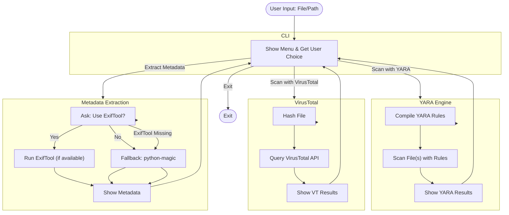

## malyz3r: Advanced Malware Scanner 🕵️‍♂️

Malware detection toolkit built for **security researchers**, **blue teams**, and **DFIR analysts**.  
Combines **YARA-based local scanning**, **metadata exfiltration checks**, and **VirusTotal integration** for next-level threat hunting.

---

## Features
- **Advanced YARA scanning** with real-world malware signatures:
  - Windows PE, Linux ELF, macOS Mach-O
  - PDFs and Office files with malicious macros
  - Obfuscated scripts like JS/VBS/PowerShell
- **Metadata exfiltration detection**:
  - EXIF data in documents/images
  - Suspicious author names, embedded info
- **VirusTotal API integration**:
  - Automatic file hash reputation check
  - Real-time cloud-based threat detection
- **Production-ready deployment** with GitHub Actions
- **Comprehensive testing suite** with safe samples

---

## 📦 Installation

### 1. Clone the repository
```bash
git clone https://github.com/gl1tch0x1/malyz3r.git
cd malyz3r
```
### 2. Install dependencies
```bash
python3 -m venv venv
source venv/bin/activate   # Windows: venv\Scripts\activate
pip install --upgrade pip
pip install -r requirements.txt
```
### 3. Install system dependencies
#### Ubuntu/Debian:
```bash
sudo apt update
sudo apt install -y yara exiftool libmagic1
```
#### macOS: 
``` bash 
brew install yara exiftool
```
#### Windows:
* [Install YARA](https://github.com/VirusTotal/yara/releases/tag/v4.5.4).
* [Install ExifTool](https://exiftool.org/install.html#Windows).


### 🔑 VirusTotal API Setup

#### Get your free API key:

* Create an account on VirusTotal
* Go to Profile → API Key.
* Copy your key.

You'll be prompted to enter this API key the first time you run the tool, and it will be securely stored locally in 
``` bash ~/.malware_scanner/config.json.```

### Usage

Run the scanner:
```bash
python run_scanner.py 
```


### Example run:

Enter the full path of the file or directory to scan:
``` sql
> /home/user/suspicious.exe

[SCANNING] Extracting metadata...
[SCANNING] Checking YARA rules...
[SCANNING] Querying VirusTotal...

Scan Report:
+----------------------------------+-----------+------------------------------+
| Rule Matched                      | Severity  | Description                  |
+----------------------------------+-----------+------------------------------+
| PE_SUSPICIOUS_IMPORTS             | High      | Suspicious PE imports found  |
| TrickBot_Signature                | Critical  | TrickBot malware detected    |
+----------------------------------+-----------+------------------------------+

[VT Result] File hash found in 37/72 engines → MALICIOUS
```

### Testing:
Run the test suite:
```bash 
pytest -v
```

Safe test file:
``` bash
tests/safe_sample.txt
```


### Download YARA Rules, if you want:
https://github.com/Yara-Rules/rules


### Adding Custom YARA Rules

* Place new .yar files in rules/.
* Follow the proper metadata format:
```yara
rule ExampleMalware
{
    meta:
        author = "Your Name"
        severity = "high"
        description = "Detects Example Malware"
    strings:
        $a = "malicious_string" ascii
    condition:
        $a
}
```
### CLI:
Customize colors and themes in:
```python
cli.py
```

---

### **Key Highlights**

- Ready-to-use GitHub documentation.
- Clearly explained **installation**, **usage**, and **VirusTotal integration**.
- Safe sample file workflow included.
- Future roadmap section for community engagement.

----------------------------------------------------------------

## 🗺️ Workflow Architecture


## 🌟 Future Improvements

 * Add machine learning-powered detection.
 * Add email attachment scanning.
 * Integration with SIEM tools like Splunk.
 * Web dashboard for reporting.

-----------------------------------------------------------------
## 💻 Author

* Aashish Pandey
* GitHub: [gl1tch0x1](https://github.com/gl1tch0x1).
* LinkedIn: [Aashish Pandey](https://linkedin.com/mr-aashish).

**Cybersecurity Enthusiast & Open Source Contributor**


